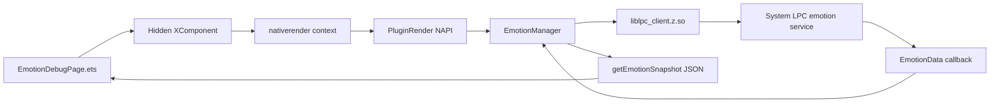

# 情绪识别验证页 Spec

## 背景

当前蓝区仓库已经从黄区迁入 LPC 情绪识别的基础桥接能力。现状是 `pages/Index` 在 XComponent 加载后调用 native 方法启动情绪识别，并在左上角显示一个 `Emotion <state>` 浮层。

这个 POC 能证明链路是否启动，但不适合验证“情绪识别效果”和“表情变化响应速度”。原因是页面只显示一个最终状态，缺少初始化状态、错误阶段、置信度、事件统计、历史变化，以及从用户做表情到 App 收到变化结果的端到端延迟。

## 目标

新增一个专门的情绪识别验证入口和页面，让测试人员不用只依赖 hilog，也能在 App 内确认：

- LPC 系统库是否成功加载。
- 情绪识别是否成功初始化和启动。
- 是否持续收到系统回调。
- 当前识别出的情绪类别是什么。
- 每个情绪类别的置信度是多少。
- 最近一段时间情绪是否发生变化。
- 人做出一个新表情后，App 多久首次识别到变化。
- 识别结果多久进入稳定状态。
- 当前 LPC 回调频率是否接近期望的 `period=100ms`。
- 如果失败，失败发生在 `dlopen`、`dlsym`、`Init`、`CreateCognition`、`RegisterListener`、`Start` 还是 `SetParameter`。

## 非目标

- 不在蓝区实现情绪识别模型。
- 不做模拟情绪轮播或假数据 fallback。
- 不修改黄区项目。
- 不把代码推到 `main` / `master`。
- 不解决系统签名、UDID、`system_core` profile 的签发问题。
- 不声称能测到系统模型内部推理耗时；页面只测 App 可观测的端到端响应延迟。

## 情绪识别原理

蓝区本身不计算情绪。真正的情绪判断由系统 LPC 能力完成，入口是：

```text
/system/lib64/liblpc_client.z.so
```

蓝区 native 层负责：

1. `dlopen("/system/lib64/liblpc_client.z.so")`
2. `dlsym("GetLpcManagerInst")`
3. `mgrHost->Init()`
4. `CreateCognition({ type = COGNITION_TYPE_EMOTION, subAttr = NORMAL })`
5. `RegisterListener(...)`
6. `Start(APP, { reportMode = REPORT_MODE_PERIOD, period = 100 })`
7. `SetParameter("RealTime", "True")`
8. 在 `OnEvent` 中接收 `EmotionData`

`EmotionData` 中的关键字段：

```cpp
struct EmotionRes {
    int8_t emotion;
    int8_t emoConfidence[EMO_CLS_NUM_MAX];
};

struct EmotionData {
    uint32_t modalType;
    uint32_t emoNum;
    EmotionRes emoRes[0];
};
```

`emotion` 是系统判断出的最高情绪下标。当前需要展示的 6 类映射为：

```text
0 ecstatic
1 happy
2 neutral
3 sad
4 angry
5 crying
```

蓝区可以做的计算只限于展示和诊断：

- 读取 `emotion` 下标并映射为字符串。
- 读取 `emoConfidence[0..5]` 作为各情绪置信度。
- 使用 `emoConfidence[emotion]` 作为当前情绪置信度。
- 统计事件数量、最后更新时间、数据年龄。
- 维护最近 N 条事件历史。
- 基于最近事件历史计算表情变化的首次识别延迟和稳定识别延迟。

## 推荐方案

新增页面 `pages/EmotionDebugPage`，主菜单新增第五张卡片 `情绪识别验证`。页面内部放置一个最小 XComponent 来获取 `nativerender` native context，因为当前 native 方法是通过 XComponent `.onLoad()` 暴露给 ArkTS 的。

推荐理由：

- 不干扰现有四个 Demo 入口。
- 验证行为集中，测试路径清楚。
- 可以显式展示 init/start/stop/reset 按钮。
- 后续可以保留为调试工具，不影响正常生成式 UI 页面。

备选方案：

- 在 `pages/Index` 增加一个 route 参数进入情绪调试模式。实现量小，但页面已经很大，继续塞诊断 UI 会增加维护成本。
- 只增强当前左上角浮层。实现最小，但无法满足“好验证”的目标。

## 页面入口

修改 `pages/MainMenu.ets`：

- 现有四个卡片保持不变。
- 新增第五个卡片：
  - 标题：`情绪识别验证`
  - 副标题：`LPC 状态 / 置信度 / 回调历史`
  - 点击后 `router.pushUrl({ url: 'pages/EmotionDebugPage' })`

修改 `resources/base/profile/main_pages.json`：

- 增加 `"pages/EmotionDebugPage"`。

## 页面布局

页面使用竖屏验证面板，不做复杂渲染。

主要区域：

1. 顶部状态栏
   - 当前运行状态：`Idle / Initializing / Running / Stopped / Error`
   - 当前情绪：大号显示，例如 `happy`
   - 当前置信度：例如 `87`
   - 数据年龄：例如 `last update 230 ms ago`

2. 操作区
   - `Init`
   - `Start`
   - `Stop`
   - `Reset`
   - `Copy Diagnostics` 可选，后续如果需要再做

3. 置信度区
   - 6 条进度条：
     - `ecstatic`
     - `happy`
     - `neutral`
     - `sad`
     - `angry`
     - `crying`
   - 当前最大情绪高亮。

4. 事件统计区
   - `initialized`
   - `running`
   - `eventCount`
   - `lastEventTime`
   - `callbackRatePerSec`
   - `modalType`
   - `emoNum`

5. 错误诊断区
   - `lastErrorStage`
   - `lastErrorMessage`
   - `libraryPath`

6. 表情变化测试区
   - 当前基线情绪，例如 `neutral`。
   - 测试目标：
     - `Any change`：任意非基线情绪都算变化。
     - 指定目标：`happy / sad / angry / crying / ecstatic / neutral`，用于测试特定表情。
   - `开始变化测试` 按钮。
   - 3 秒倒计时，倒计时结束时显示 `现在做表情`。
   - 首次识别延迟：从 `现在做表情` 到首次收到目标变化事件的时间。
   - 稳定识别延迟：从 `现在做表情` 到连续 3 次同一目标情绪的时间。
   - 测试状态：`Ready / Countdown / WaitingChange / FirstDetected / Stable / Timeout`。
   - 超时阈值：默认 10 秒，超时后保留历史和诊断数据。

7. 历史区
   - 最近 20 条事件。
   - 每条显示：时间、情绪、置信度。
   - 在变化测试期间，标记 `test start`、`first detected`、`stable` 三个时间点。

## Native 接口设计

保留当前接口：

```text
initEmotionManager(): boolean
startEmotionDetection(): boolean
stopEmotionDetection(): boolean
getEmotionState(): string
```

新增诊断接口：

```text
getEmotionSnapshot(): string
resetEmotionDiagnostics(): boolean
```

`getEmotionSnapshot()` 返回 JSON 字符串：

```json
{
  "initialized": true,
  "running": true,
  "snapshotTimeMs": 1710000000230,
  "emotion": "happy",
  "emotionIndex": 1,
  "confidence": 87,
  "confidences": {
    "ecstatic": 12,
    "happy": 87,
    "neutral": 20,
    "sad": 3,
    "angry": 1,
    "crying": 0
  },
  "eventCount": 128,
  "eventSequence": 128,
  "lastEventTimeMs": 1710000000000,
  "lastDataAgeMs": 230,
  "lastEmotionChangeTimeMs": 1710000000000,
  "modalType": 0,
  "emoNum": 1,
  "recentEvents": [
    {
      "sequence": 126,
      "timeMs": 1709999999800,
      "emotion": "neutral",
      "emotionIndex": 2,
      "confidence": 78
    },
    {
      "sequence": 127,
      "timeMs": 1709999999900,
      "emotion": "happy",
      "emotionIndex": 1,
      "confidence": 82
    },
    {
      "sequence": 128,
      "timeMs": 1710000000000,
      "emotion": "happy",
      "emotionIndex": 1,
      "confidence": 87
    }
  ],
  "lastErrorStage": "",
  "lastErrorMessage": "",
  "libraryPath": "/system/lib64/liblpc_client.z.so"
}
```

失败时示例：

```json
{
  "initialized": false,
  "running": false,
  "snapshotTimeMs": 1710000000230,
  "emotion": "neutral",
  "emotionIndex": 2,
  "confidence": 0,
  "confidences": {
    "ecstatic": 0,
    "happy": 0,
    "neutral": 0,
    "sad": 0,
    "angry": 0,
    "crying": 0
  },
  "eventCount": 0,
  "eventSequence": 0,
  "lastEventTimeMs": 0,
  "lastDataAgeMs": -1,
  "lastEmotionChangeTimeMs": 0,
  "modalType": 0,
  "emoNum": 0,
  "recentEvents": [],
  "lastErrorStage": "dlopen",
  "lastErrorMessage": "Permission denied",
  "libraryPath": "/system/lib64/liblpc_client.z.so"
}
```

## Native 内部状态

`EmotionManager` 增加一个诊断快照结构，所有字段由 mutex 保护。

建议字段：

```cpp
struct EmotionSnapshot {
    bool initialized;
    bool running;
    int64_t snapshotTimeMs;
    int emotionIndex;
    std::string emotion;
    int confidence;
    int confidences[6];
    uint64_t eventCount;
    uint64_t eventSequence;
    int64_t lastEventTimeMs;
    int64_t lastEmotionChangeTimeMs;
    uint32_t modalType;
    uint32_t emoNum;
    std::string lastErrorStage;
    std::string lastErrorMessage;
};
```

最近事件使用 ring buffer 保存，最多保留 20 条：

```cpp
struct EmotionEventSnapshot {
    uint64_t sequence;
    int64_t timeMs;
    int emotionIndex;
    std::string emotion;
    int confidence;
};
```

时间基准：

- `snapshotTimeMs`、`lastEventTimeMs`、`lastEmotionChangeTimeMs`、`recentEvents[].timeMs` 必须使用同一个 native 侧 wall-clock 毫秒时间源。
- 表情变化测试开始时，ArkTS 立即调用 `getEmotionSnapshot()`，使用返回的 `snapshotTimeMs` 作为 `testStartTimeMs`，避免 ArkTS 和 native 时间源不一致。

状态更新规则：

- 初始化成功后设置 `initialized=true`。
- `StartDetection()` 成功后设置 `running=true`。
- `StopDetection()` 后设置 `running=false`，不清空最后一次情绪，便于观察最后状态。
- `OnEvent()` 中：
  - `eventCount++`
  - `eventSequence++`
  - 更新 `lastEventTimeMs`
  - 更新 `modalType`、`emoNum`
  - 如果 `emoNum > 0`，更新 `emotionIndex`、`emotion`、`confidences[0..5]`、`confidence`
  - 如果情绪类别相对上一次发生变化，更新 `lastEmotionChangeTimeMs`
  - 将事件追加到最近 20 条事件的 ring buffer，供页面做变化速度分析
- 每个失败分支都写入 `lastErrorStage` 和 `lastErrorMessage`。

## 表情变化响应速度测试

验证页需要提供一个明确的表情变化测试流程，测量用户做表情后的 App 可见响应速度。

核心指标：

- `firstChangeLatencyMs`：从页面显示 `现在做表情` 到第一次收到目标变化事件的时间。
- `stableChangeLatencyMs`：从页面显示 `现在做表情` 到连续 3 个有效事件都保持目标情绪的时间。
- `callbackRatePerSec`：最近 2 秒内 native 事件数量 / 时间窗口。
- `lastDataAgeMs`：当前 snapshot 距离最近事件的年龄。

测试流程：

1. 用户先点击 `Start`，确认 `running=true` 且 `eventCount` 增长。
2. 页面读取当前情绪作为基线，例如 `neutral`。
3. 用户选择测试目标：
   - 默认 `Any change`，适合快速验证“做表情后是否有变化”。
   - 可指定 `happy`、`sad`、`angry` 等目标，适合验证某个表情是否能被正确识别。
4. 用户点击 `开始变化测试`。
5. 页面倒计时 `3, 2, 1`。
6. 倒计时结束时显示 `现在做表情`，立即调用一次 `getEmotionSnapshot()`，使用返回的 `snapshotTimeMs` 记录 `testStartTimeMs`。
7. 页面以 200ms 轮询 `getEmotionSnapshot()`，每次用 `recentEvents` 补齐轮询间隔内的 native 回调事件。
8. 首次命中目标事件时记录 `firstChangeLatencyMs`。
9. 连续 3 个目标事件后记录 `stableChangeLatencyMs`。
10. 10 秒内没有命中目标则进入 `Timeout`，显示最近事件历史，方便判断是没有变化、识别成其他情绪，还是没有回调。

命中规则：

- `Any change`：`event.emotion != baselineEmotion` 且 `event.confidence > 0`。
- 指定目标：`event.emotion == targetEmotion` 且 `event.confidence > 0`。
- 稳定状态：连续 3 个命中规则的事件，且事件时间都晚于 `testStartTimeMs`。

展示示例：

```text
Baseline: neutral
Target: happy
Current: happy 87
First detected: 420 ms
Stable detected: 720 ms
Callback rate: 9.8/s
Data age: 65 ms
Events after prompt: 7
```

注意：

- 这个指标包含用户反应时间、LPC 采样窗口、系统推理、native 回调和 ArkTS 展示链路，因此是端到端可见延迟。
- 如果需要更接近真实回调时间，页面必须使用 native `recentEvents.timeMs` 计算，不应只用 ArkTS 轮询到 snapshot 的时间。
- UI 轮询周期建议 200ms；native 仍按 `period=100ms` 请求 LPC 回调。这样页面负载可控，同时不会明显掩盖 100ms 级别变化。

## ArkTS 页面数据流



页面行为：

- `aboutToAppear`：准备 UI 状态。
- `XComponent.onLoad`：保存 native context。
- 用户点击 `Init`：调用 `initEmotionManager()`，立即刷新 snapshot。
- 用户点击 `Start`：调用 `startEmotionDetection()`，启动 200ms 轮询 `getEmotionSnapshot()`。
- 用户点击 `Stop`：调用 `stopEmotionDetection()`，停止轮询。
- 用户点击 `开始变化测试`：执行倒计时并进入表情变化响应速度测试。
- `aboutToDisappear` / XComponent `.onDestroy`：调用 stop 并清理 timer。

## 验证标准

构建验证：

```powershell
$env:DEVECO_SDK_HOME='D:\software\deveco\DevEco Studio\sdk'
$env:PATH='D:\software\deveco\DevEco Studio\jbr\bin;' + $env:PATH

& 'D:\software\deveco\DevEco Studio\tools\node\node.exe' `
  'D:\software\deveco\DevEco Studio\tools\hvigor\bin\hvigorw.js' `
  --mode module -p product=default -p buildMode=debug assembleHap --no-daemon
```

运行验证：

- App 首页出现 `情绪识别验证`。
- 进入页面后点击 `Init`，页面展示初始化结果。
- 点击 `Start` 后：
  - `running=true`
  - `eventCount` 持续增长。
  - `lastDataAgeMs` 保持更新。
  - 当前情绪和置信度条随回调变化。
- 点击 `开始变化测试` 后：
  - 页面倒计时后显示 `现在做表情`。
  - 做出明显表情后，页面显示 `firstChangeLatencyMs`。
  - 目标情绪连续稳定 3 次后，页面显示 `stableChangeLatencyMs`。
  - `callbackRatePerSec` 接近 native 回调频率，理想情况下约 10/s。
- 点击 `Stop` 后：
  - `running=false`
  - `eventCount` 不再增长。
- 如果权限不满足：
  - 页面显示 `Error`
  - `lastErrorStage=dlopen`
  - `lastErrorMessage` 包含 `Permission denied`

日志验证：

```powershell
hdc shell hilog -x | Select-String -Pattern "Emotion|LPC|Permission denied"
```

## 分支策略

后续实现继续基于当前本地分支：

```text
codex/emotion-recognition-migration
```

不推 `main` / `master`。如果需要远程验证，再由用户明确指定远程分支名后推送。

## 风险和注意事项

- 当前 native 方法依赖 XComponent context，所以验证页必须加载 `nativerender` XComponent，不能直接纯 ArkTS 调 native。
- `liblpc_client.z.so` 仍然要求系统签名能力；普通签名下页面会稳定显示权限错误，这是预期诊断结果。
- 置信度数组长度是 `EMO_CLS_NUM_MAX=19`，页面只展示当前已知的前 6 类。
- 不应加入 mock 轮播，否则会混淆真实 LPC 是否成功。
- `EmotionManager` 的状态读写必须加锁，避免 callback 线程和 ArkTS 轮询同时访问。
- 表情变化测试只测 App 可见延迟，不代表系统模型内部单次推理耗时。
